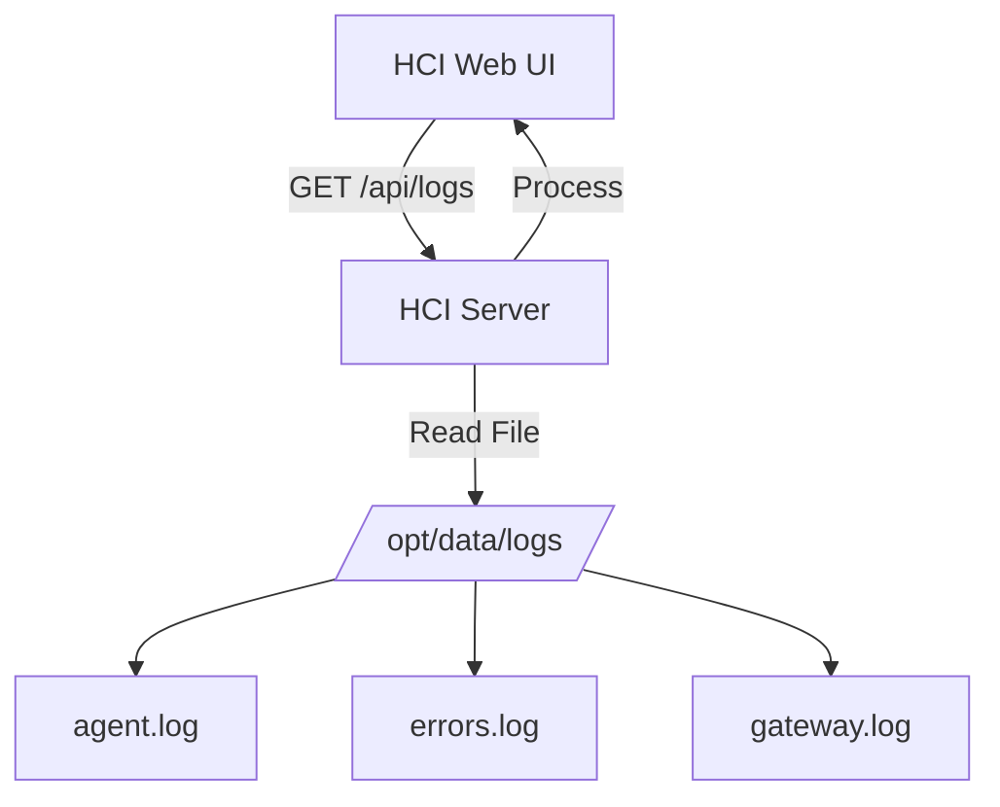

# Implementation Plan - HCI Log and Usage Fixes

This plan addresses two main issues in the Hermes Control Interface (HCI) when running within a Docker environment:
1. **HCI logs not showing**: Caused by incorrect log paths and lack of support for direct `gateway.log` reading in `server.js`.
2. **HCI Usage calculation empty**: Caused by missing Google Gemini pricing definitions in `calculateCost`.

## Proposed Changes

### 1. Log Collection Fixes (`server.js`)
- Update `app.get('/api/gateway/:profile/logs', ...)` to:
    - Support `logType === 'gateway'` by reading directly from `CONTROL_HOME/logs/gateway.log` instead of relying on `journalctl` (which doesn't exist in the container).
    - Ensure all log paths use `CONTROL_HOME/logs`.
- Update `app.get('/api/logs', ...)` (Unified Logs) to:
    - Read from `CONTROL_HOME/logs` directly.
    - Remove `journalctl` dependency for gateway logs.

### 2. Usage Calculation Fixes (`server.js`)
- Add `google` to `PROVIDER_MAP`.
- Add custom pricing for Gemini models (e.g., `gemini-1.5-pro`, `gemini-1.5-flash`) if they are not correctly resolved by `genai-prices`.
- Note: The user mentioned "Google Gemini 3.1 Pro" - we will map this to standard Gemini 1.5 Pro pricing if specific "3.1" pricing is unavailable, or provide a custom fallback.

## Todo List for Code Mode
- [ ] Modify `server.js`: Update log path logic for Docker.
- [ ] Modify `server.js`: Add Google Gemini pricing support.
- [ ] Restart HCI service and verify logs are visible.
- [ ] Verify usage charts are populated for Gemini sessions.

## Mermaid Diagram - Log Flow

