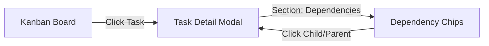

# Implementation Plan - Kanban & Usage Enhancements

This plan addresses the UI/UX and functionality improvements requested in `TODO.md` for the Hermes Control Interface.

## Proposed Changes

### 1. Kanban Modal Improvements
- **Width & Adjustability**:
    - Update [`src/css/office.css`](hermes_workspace/repos/hermes-control-interface/src/css/office.css:489) to increase `.kb-detail-popup` default width from `420px` to `680px`.
    - Add `resize: both; overflow: auto;` to allow manual resizing.
- **Dependency Clickability**:
    - Modify `showKanbanTask` in [`src/js/office-kanban.js`](hermes_workspace/repos/hermes-control-interface/src/js/office-kanban.js:712) to wrap dependency chips in `onclick="showKanbanTask('...')"` handlers.
- **Deliverables Visibility**:
    - Investigate why deliverables aren't showing. Update [`server.js`](hermes_workspace/repos/hermes-control-interface/server.js:3724) to ensure `task_attachments` and deliverables are correctly fetched and displayed.

### 2. Usage Tab Robustness
- **Model Enumeration**:
    - Enhance [`calculateCost`](hermes_workspace/repos/hermes-control-interface/server.js:47) to include a wider range of models (Claude 3.5, GPT-4o, etc.).
    - Improve aggregation logic in [`/api/usage/:days`](hermes_workspace/repos/hermes-control-interface/server.js:5138) to better handle "unknown" models by trying to parse provider prefixes.

## Todo List
- [ ] **CSS**: Update `.kb-detail-popup` width and add resize handle.
- [ ] **JS**: Implement clickable dependency chips in `office-kanban.js`.
- [ ] **JS**: Add deliverable check in Kanban details (check if file exists in workspace even if not in DB).
- [ ] **Server**: Expand `CUSTOM_PRICING` in `server.js` with current market rates for common models.
- [ ] **Server**: Update `calculateCost` to be more resilient to versioned model names (e.g. `gemini-1.5-pro-002`, `gemini-3.1-pro-preview`).

## Mermaid Diagram - Task Dependency Navigation

