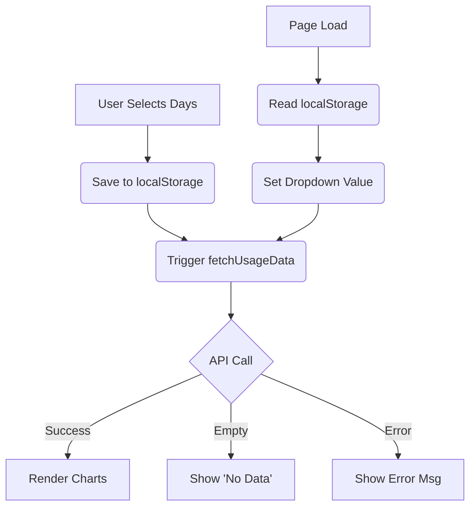

# Plan - Fix Usage Analytics and Time Dropdown

## Problem Analysis

1.  **Buggy Time Dropdown:** The `#usage-days` dropdown in `src/js/pages/usage.js` is reset to "7 days" whenever the page is loaded/reloaded because the template hardcodes `selected` on the 7-day option and there is no logic to persist the user's selection or handle the `change` event properly. The "flashing" likely occurs because the page re-renders or the dropdown state is overwritten during the async `loadUsage` execution.
2.  **Usage Data Missing:** While `server.js` has been updated with a dynamic pricing fetcher, the usage may still be empty due to:
    *   `CONTROL_HOME` or profile paths not resolving correctly within the Docker container.
    *   `state.db` files being empty or not having sessions within the requested time range.
    *   The dynamic pricing fetch from OpenRouter failing, leaving `DYNAMIC_PRICING` empty (though fallback logic should handle it).

## Proposed Fixes

### 1. Fix Time Dropdown Bug (`src/js/pages/usage.js`)
*   **Persist Selection:** Use `localStorage` to save the selected `usage-days` value.
*   **Prevent Flash/Reset:**
    *   Update the `loadUsage` template to check `localStorage` for the selected value.
    *   Add a `change` event listener to the dropdown that saves the selection and calls `fetchUsageData()`.
    *   Ensure `loadUsage` does not accidentally re-render the template while an async fetch is in progress.

### 2. Ensure Usage Data Visibility (`server.js` & `src/js/pages/usage.js`)
*   **Verify Database Access:** I will check the actual `state.db` files if possible, or add more robust error logging in `server.js` to see where the aggregation fails.
*   **Fix Fallback Pricing:** Ensure `calculateCost` has sensible defaults even if dynamic pricing is unavailable.
*   **UI Feedback:** Improve `usage.js` to show specific "No data found" messages instead of just empty charts if the API returns an empty but successful response.

## Todo List

- [ ] **Frontend Fixes (`src/js/pages/usage.js`)**
    - [ ] Update `loadUsage` template to remove hardcoded `selected` on "7 days".
    - [ ] Implement `localStorage` persistence for the "days" selection.
    - [ ] Add `change` event listener to `#usage-days` to trigger `fetchUsageData()` and save state.
    - [ ] Debug the "flashing" by ensuring the dropdown doesn't lose focus or reset during async loads.
- [ ] **Backend Verification (`server.js`)**
    - [ ] Add logging to `app.get('/api/usage/:days')` to track which `state.db` files are being read.
    - [ ] Ensure `DYNAMIC_PRICING` is actually populated (log its size after fetch).
    - [ ] Verify `calculateCost` logic with the new `normModel` stripping.
- [ ] **Deployment**
    - [ ] Restart the HCI server in the container: `npx pm2 restart hci`.
    - [ ] Verify both the dropdown behavior and the data visibility.

## Workflow

